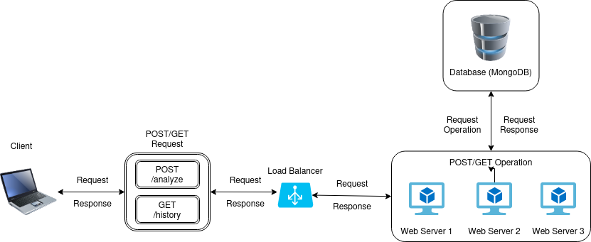
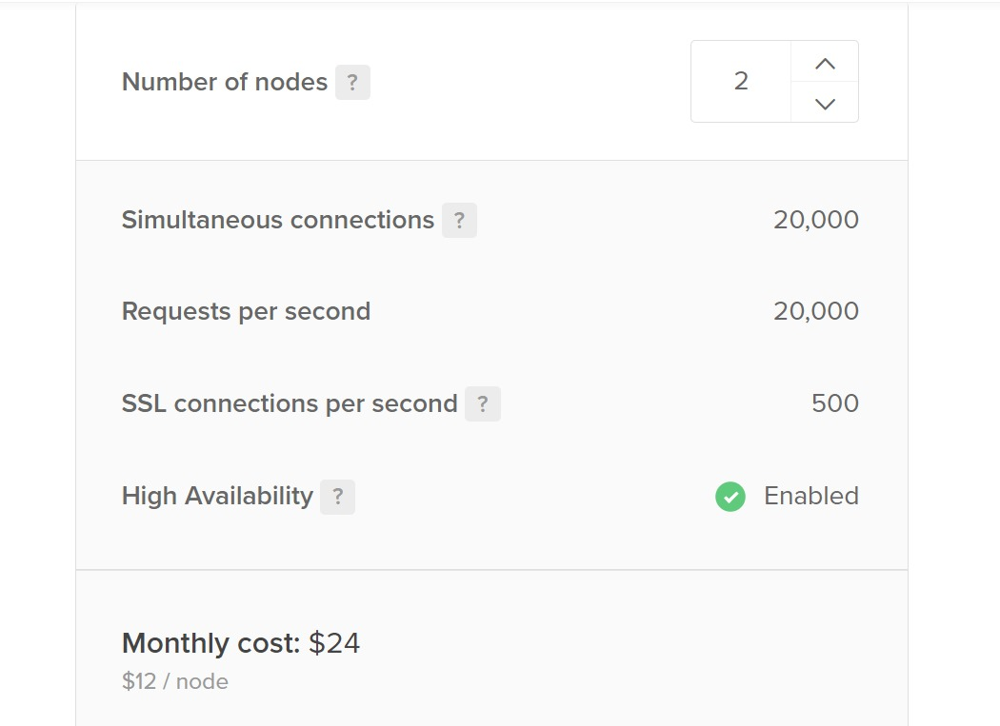
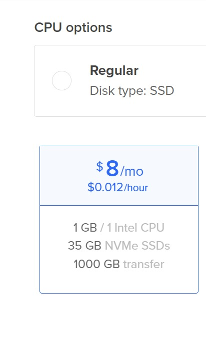
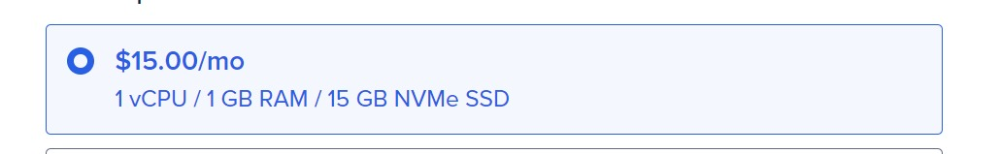

# Laporan Final Project TKA

## Kelas A Kelompok 1
| Nama             | NRP             |
|------------------|-----------------|
| Made Gde Krisna Wangsa| 5027201047 |
| Ong Valencio Jesse P. | 5027221002 |
| Salomo                | 5027221063 |
| Rafif Dhimaz Ardhana  | 5027221066 |

## Introduction
Anda adalah seorang lulusan Teknologi Informasi, sebagai ahli IT, salah satu kemampuan yang harus dimiliki adalah Keampuan merancang, membangun, mengelola aplikasi berbasis komputer menggunakan layanan awan untuk memenuhi kebutuhan organisasi.

Pada suatu saat anda mendapatkan project untuk mendeploy sebuah aplikasi Sentiment Analysis dengan komponen Backend menggunakan python dengan spesifikasi sebagai yang telah ditentukan. Kemudian juga disediakan sebuah Frontend sederhana menggunakan index.html dan styles.css dengan tampilan antarmuka yang telah ditentukan.

Kemudian anda diminta untuk mendesain arsitektur cloud yang sesuai dengan kebutuhan aplikasi tersebut. Apabila dana maksimal yang diberikan adalah 1 juta rupiah per bulan (65 US$) konfigurasi cloud terbaik seperti apa yang bisa dibuat?

Pada final project TKA ini, diminta untuk merancang arsitektur cloud untuk deploy aplikasi. Diberikan pilihan lingkungan cloud yakni menggunakan Digital Ocean, Microsoft Azure, dan Local Virtual Machine dan kami memutuskan untuk menggunakan Digital Ocean. Setelah itu, diminta untuk mendeploy aplikasi dan mengetes load balancing menggunakan locust. Kita diminta untuk mendesain arsitektur cloud yang hemat biaya untuk web aplikasi dengan komponen backend dan frontend yang telah ditetapkan yang akan digunakan untuk organisasi.

## II. Rancangan Arsitektur Komputasi Awan dan Spesifikasi

### Rancangan Arsitektur

### Spesifikasi
- #### Load Balancer

- #### Worker

- #### Database

- #### Tabel Spesifikasi
| No | Nama | Spesifikasi | Fungsi | Harga/Bulan |
|----|-----|----------|----------|----------|
| 1 | Load Balancing | 1vCPU, 1GB Memory | Load Balancer | $24 USD |
| 2 | App 1 | 1vCPU, 1GB Memory | App Worker | $8 USD |
| 3 | App 2 | 1vCPU, 1GB Memory | App Worker | $8 USD |
| 4 | Database | 1vCPU, 1GB Memory | Database | $15 USD |

