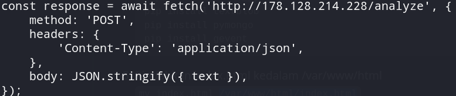

# Laporan Final Project TKA

## Kelas A Kelompok 1
| Nama             | NRP             |
|------------------|-----------------|
| Made Gde Krisna Wangsa| 5027201047 |
| Ong Valencio Jesse P. | 5027221002 |
| Salomo                | 5027221063 |
| Rafif Dhimaz Ardhana  | 5027221066 |

## I. Overview
Anda adalah seorang lulusan Teknologi Informasi, sebagai ahli IT, salah satu kemampuan yang harus dimiliki adalah Keampuan merancang, membangun, mengelola aplikasi berbasis komputer menggunakan layanan awan untuk memenuhi kebutuhan organisasi.

Pada suatu saat anda mendapatkan project untuk mendeploy sebuah aplikasi Sentiment Analysis dengan komponen Backend menggunakan python: <a href="attachments/backend/sentiment-analysis.py">sentiment-analysis.py</a> dengan spesifikasi sebagai berikut

Kemudian juga disediakan sebuah Frontend sederhana menggunakan <a href="attachments/frontend/index.html">index.html</a> dan <a href="attachments/frontend/styles.css">styles.css</a> yang telah ditetapkan.

Kemudian anda diminta untuk mendesain arsitektur cloud yang sesuai dengan kebutuhan aplikasi tersebut. Apabila dana maksimal yang diberikan adalah 1 juta rupiah per bulan (65 US$) konfigurasi cloud terbaik seperti apa yang bisa dibuat?

## II. Architecture & Specification
### Rancangan Arsitektur


### Spesifikasi
| No | Nama | Spesifikasi | Fungsi | Harga/Bulan |
|----|-----|----------|----------|----------|
| 1 | VM1 | 1 GB Memory / 1 Intel vCPU / 35 GB Disk | Load Balancer | $8 USD |
| 2 | VM2 | 1 GB Memory / 1 Intel vCPU / 35 GB Disk | App Worker 1 | $8 USD |
| 3 | VM3 | 1 GB Memory / 1 Intel vCPU / 35 GB Disk | App Worker 2 | $8 USD |
| 4 | DB1 | 1 GB RAM / 1vCPU / 15 GB Disk | Database | $15 USD

## III. Configuration

### Database
- Copy dan paste connection string yang telah ditetapkan oleh Digital Ocean ke MongoDB Compass
- Connect dan DB siap digunakan

<br>

### Worker 1
1. Hubungkan terminal dengan IP worker 1 dengan user `root` dengan password yang telah ditentukan
<br>

2. Download resource yang telah ditetapkan
```
wget https://raw.githubusercontent.com/fuaddary/fp-tka/main/Resources/FE/index.html
wget https://raw.githubusercontent.com/fuaddary/fp-tka/main/Resources/FE/styles.css
wget https://raw.githubusercontent.com/fuaddary/fp-tka/main/Resources/BE/sentiment-analysis.py
```
3. Install dependencies dan modules yang dibutuhkan untuk pengerjaan
```
sudo apt update
sudo apt upgrade -y
sudo apt install nginx -y

sudo apt update
sudo apt install python3 -y
sudo apt install python3-pip -y
sudo apt install python3.12-venv

python3 -m venv myenv
source myenv/bin/activate

pip install flask
pip install flask_cors
pip install gunicorn
pip install flask_pymongo
pip install textblob
pip install pymongo
pip install gevent
```
4. Pindahkan index.html ke /var/www/

`mv index.html /var/www/html/index.html`

5. Modifikasi URL yang akan difetch dengan IP worker 1
<br>
<br>

6. Tambahkan konfigurasi untuk /etc/nginx/sites-enabled/default
<br>

7. Modifikasi konfigurasi URL Database pada sentiment-analysis.py dengan connection string database
<br>

8. Restart service nginx

`sudo service nginx restart`

9. Run sentiment-analysis.py
<br>

10. Test request pada endpoint menggunakan `thunder client` hingga request berhasil
<br>

### Worker 2
1. Hubungkan terminal dengan IP worker 2 dengan user `root` dengan password yang telah ditentukan
<br>

2. Download resource yang telah ditetapkan
```
wget https://raw.githubusercontent.com/fuaddary/fp-tka/main/Resources/FE/index.html
wget https://raw.githubusercontent.com/fuaddary/fp-tka/main/Resources/FE/styles.css
wget https://raw.githubusercontent.com/fuaddary/fp-tka/main/Resources/BE/sentiment-analysis.py
```
3. Install dependencies dan modules yang dibutuhkan untuk pengerjaan
```
sudo apt update
sudo apt upgrade -y
sudo apt install nginx -y

sudo apt update
sudo apt install python3 -y
sudo apt install python3-pip -y
sudo apt install python3.12-venv

python3 -m venv myenv
source myenv/bin/activate

pip install flask
pip install flask_cors
pip install gunicorn
pip install flask_pymongo
pip install textblob
pip install pymongo
pip install gevent
```
4. Pindahkan index.html ke /var/www/

`mv index.html /var/www/html/index.html`

5. Modifikasi URL yang akan difetch dengan IP worker 2
<br>
<br>

6. Tambahkan konfigurasi untuk /etc/nginx/sites-enabled/default
<br>

7. Modifikasi konfigurasi URL Database pada sentiment-analysis.py dengan connection string database
<br>

8. Restart service nginx

`sudo service nginx restart`

9. Run sentiment-analysis.py
<br>

10. Test request pada endpoint menggunakan `thunder client` hingga request berhasil
<br>

### Load Balancer
1. Hubungkan terminal dengan IP Load balancer dengan user `root` dan password yang telah ditentukan
<br>

2. Install Nginx
```
sudo apt update
sudo apt upgrade -y
sudo apt install nginx -y
``` 

3. Konfigurasi /etc/nginx/sites-enabled/default
```
upstream round_robin {
    server 178.128.214.228;
    server 104.248.151.206;
}

server {
    listen 80;
    root /var/www/html;
    index index.html;

    server_name _;

    location / {
        proxy_set_header Host $host;
        proxy_set_header X-Real-IP $remote_addr;
        proxy_set_header X-Forwarded-For $proxy_add_x_forwarded_for;
        proxy_pass http://round_robin;
    }
}
```

4. Restart service Nginx
`sudo service nginx restart`

5. Uji Load Balancer dengan refresh page berkali-kali
<br>
<br>

## IV. Endpoint Test
### POST/analyze
#### Worker 1 ~ 178.128.214.228
<br>

#### Worker 2 ~ 104.248.151.206
<br>


### GET /history
#### Worker 1 ~ 178.128.214.228
<br>


#### Worker 2 ~ 104.248.151.206
<br>

## V. Load Balancing Test

### 60 Seconds RPS
#### Worker 1 ~ 178.128.214.228
<br>
<br>

Grafik dengan garis hijau menunjukan RPS secara berkala selama 60 detik dengan failure rate 0% dan nilai RPS puncak yang berada pada sekitar 70 RPS.

#### Worker 2 ~ 104.248.151.206
<br>
<br>

Grafik dengan garis hijau menunjukan RPS secara berkala selama 60 detik dengan failure rate 0% dan nilai RPS puncak yang berada pada sekitar 60 RPS.

### 50/s Spawn Rate Peak Concurrency
#### Worker 1 ~ 178.128.214.228
<br>
<br>

Peak concurrency yang dapat ditangani oleh server dengan spawn rate sebanyak 50 per detik selama 60 detik dengan failure rate 0% adalah 300 pengguna.

#### Worker 2 ~ 104.248.151.206
<br>
<br>

Peak concurrency yang dapat ditangani oleh server dengan spawn rate sebanyak 50 per detik selama 60 detik dengan failure rate 0% adalah 300 pengguna.

### 100/s Spawn Rate Peak Concurrency
#### Worker 1 ~ 178.128.214.228
<br>
<br>

Peak concurrency yang dapat ditangani oleh server dengan spawn rate sebanyak 100 per detik selama 60 detik dengan failure rate 0% adalah 300 pengguna.

#### Worker 2 ~ 104.248.151.206
<br>
<br>

Peak concurrency yang dapat ditangani oleh server dengan spawn rate sebanyak 100 per detik selama 60 detik dengan failure rate 0% adalah 300 pengguna.

### 200/s Spawn Rate Peak Concurrency
#### Worker 1 ~ 178.128.214.228
<br>
<br>

Peak concurrency yang dapat ditangani oleh server dengan spawn rate sebanyak 200 per detik selama 60 detik dengan failure rate 0% adalah 300 pengguna.

#### Worker 2 ~ 104.248.151.206
<br>
<br>

Peak concurrency yang dapat ditangani oleh server dengan spawn rate sebanyak 200 per detik selama 60 detik dengan failure rate 0% adalah 300 pengguna.

### 500/s Spawn Rate Peak Concurrency
#### Worker 1 ~ 178.128.214.228
<br>
<br>

Peak concurrency yang dapat ditangani oleh server dengan spawn rate sebanyak 500 per detik selama 60 detik dengan failure rate 0% adalah 350 pengguna.

#### Worker 2 ~ 104.248.151.206
<br>
<br>

Peak concurrency yang dapat ditangani oleh server dengan spawn rate sebanyak 500 per detik selama 60 detik dengan failure rate 0% adalah 350 pengguna.

## VI. Conclusion & Recommendation
Dengan budget sebesar $65 USD/bulan sudah dapat deploy backend berupa API dan frontend webpage dengan styling ringan dengan menggunakan 1 Database, dan 3 VM dengan spesifikasi 2 VM untuk app worker dan 1 VM untuk load balancer. Selain itu, berdasarkan report dari locust, didapatkan bahwa semakin tinggi user spawn rate/s, maka jumlah cenderung meningkat secara cukup signifikan. Namun demikian, perlu diingat bahwa peak concurrency yang terlalu tinggi dapat mengakibatkan failure dalam koneksi server.

## VII. Revision
<a href="https://youtu.be/DsLjeNgH8YQ">Click Here</a>